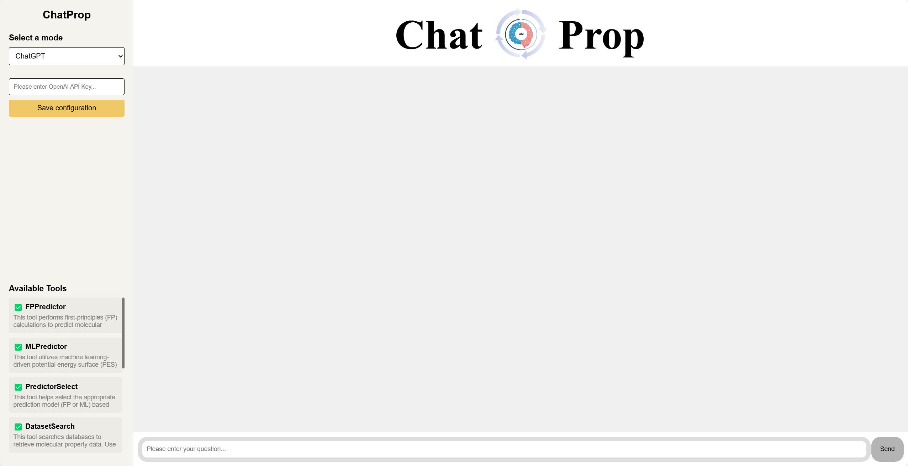

# ChatProp: Integrating Large Language Models and Physical Chemistry Tools for Enhanced Molecular Property Prediction

ChatProp is an intelligent agent designed to enhance molecular property prediction by integrating Large Language Models (LLMs) with computational tools such as first-principles (FP) calculations and machine learning-driven potential energy surface (PES) models. Unlike traditional LLMs, which often struggle with chemistry-related tasks due to limited access to specialized knowledge, ChatProp leverages advanced chemical tools to provide accurate, efficient predictions of molecular properties.

## Install dependencies

```
pip install -r requeirements.txt
```

## How to use ChatProp

Add the following line to `.bashrc` for the openai api key. 

```
# openai api key
export OPENAI_API_KEY="enter_your_api_key"
```

You can use it by running ChatProp's `main` function.

```
python main.py
```

Run ChatProp on the web.

```
python -m frontend.app
```

=======
